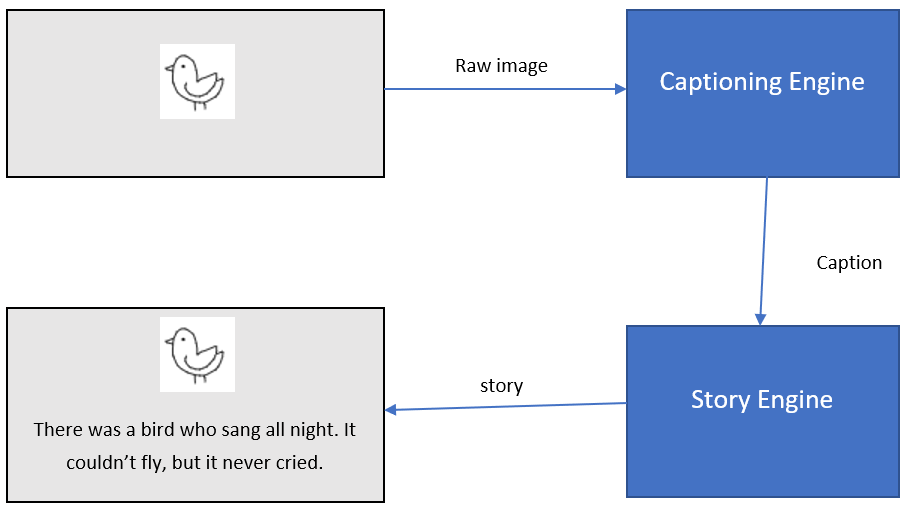
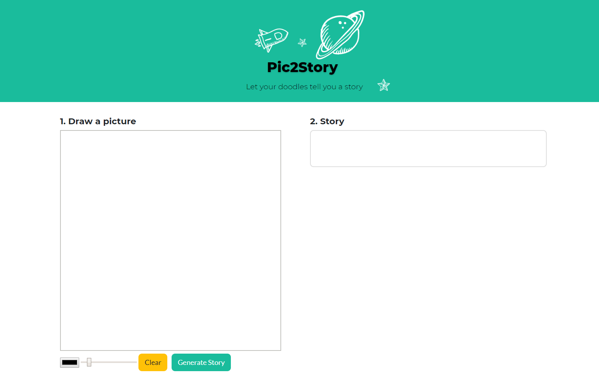
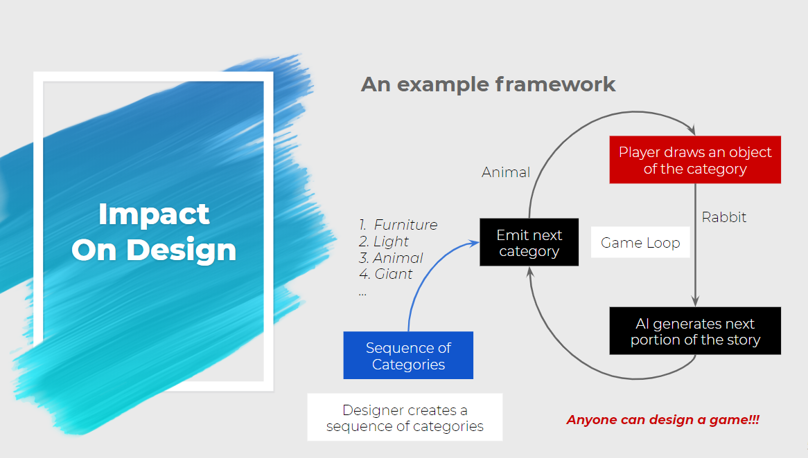
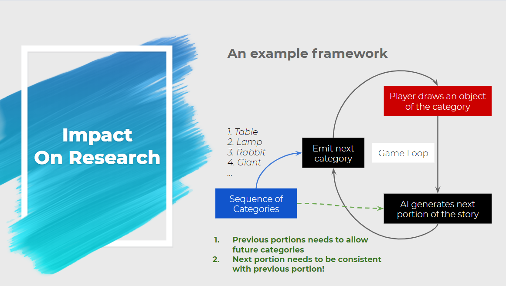

# WebAppForPic2Story
**[Final Presentation](resources/presentation.pdf)**
## Idea

## Web App UI

# Requirements
1. Tensorflow-gpu 1.3.x-1.5.x
2. flask
3. keras
4. dill
5. injector
6. Open CV

## Components
1. [Web app](frontend/pic2story.html)
2. Backend server in python-flask
3. Captioning Engine:
    - Doodle Classifier with Neural Network
    - Prompt Generator
4. Story Generator with GPT2

# Impact
## Impact on AI Based Game Design
Given the capability of creating prompts from images and generating stories based on prompts, a lot of different frameworks can be developed to facilitate designing process.

## Impact on AI Research 
- Fluent Story Generation (required for multi-plays) (past context)
- Goal-based creativity (how to evaluate) (future context)

